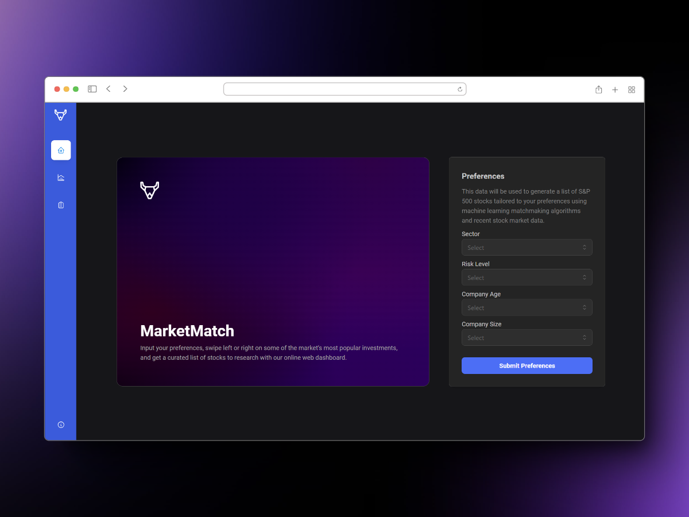
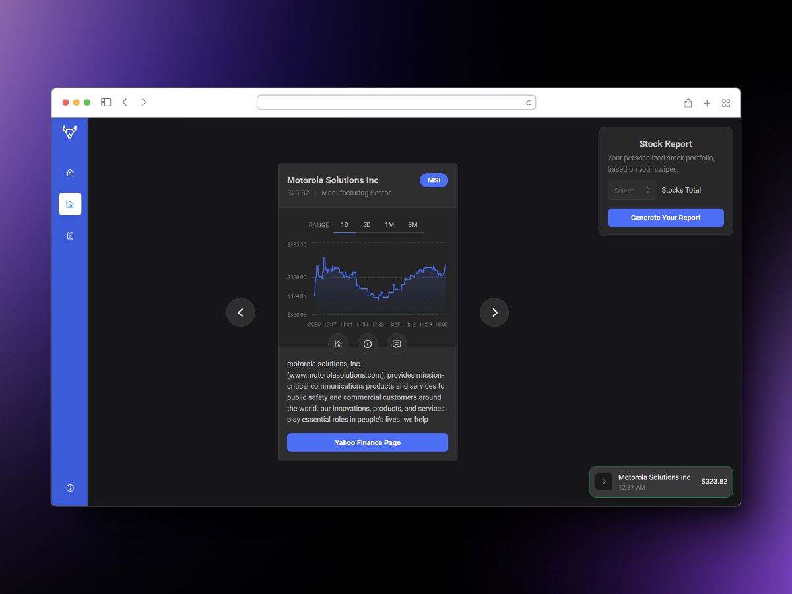

# MarketMatch

Swipe right on financial success - let our AI play matchmaker with stocks tailored just for you, making investing easy and rewarding with gamified asset allocation. Get ready to level up your portfolio!

Backend: https://github.com/Benler123/HacklyticsBackend

https://github.com/AlexT101/market-match/assets/16299285/af5b6804-5bc0-45a3-acbb-078bcd0c935b

<div>


</div>

## The Problem: A Barrier to Entry

Investing in stocks is a cornerstone of financial growth, yet a staggering 58% of individuals under 30 refrain from engaging with the stock market at all. The primary barrier? Overly technical terminology, complicated data, and the general belief that investing should be left to the experts, leaving beginners unsure of how to choose the best stocks for them.

## The Solution: Our Stock Swiping App

Our free, web and mobile-friendy dashboard is uniquely targeted to beginners. Users can effortlessly create a diverse stock portfolio tailored to their preferences, leveraging advanced filtering options based on sectors, risk levels, and return expectations. Through an intuitive swipe-based interface, users can curate this portfolio by indicating their interest in specific stocks. As users engage with the platform, our algorithm dynamically refines its recommendations, aligning with the user's evolving preferences until an optimal portfolio is achieved.

Our platform prioritizes a teaching focus through a personalized chatbot at the user’s disposal at any time. In addition to explaining technical investing vocabulary, the chatbot can offer clear explanations for subtle parameters or trends, as well as clarifying confusing terminology that beginners might struggle with.

Additionally, we integrated sentiment analysis to offer users deeper insights into specific stocks. By analyzing the most recent financial news articles related to a company, our model assigns a sentiment score ranging from 0 to 100, where lower scores indicate a negative sentiment and higher scores indicate a positive sentiment. By quantifying sentiment in this manner, users can quickly gauge market sentiment and potentially align their personal investment strategies with prevailing opinions in the financial news landscape.

## The Approach: Machine Learning and Data Visualization

Our platform utilizes IEX Cloud, a financial data API that provides us with detailed data about every stock in the S&P 500. This data was inputted into a machine learning model that uses user preferences, such as industry sector or preferred level of risk, to recommend a stock for the user to swipe on. With every swipe, corresponding data is sent back and the model's weights are adjusted based on whether you swiped right or left.

Once the user has chosen a sufficient number of stocks, they can choose to generate a report that displays all of the stocks they swiped right on. By implementing Markowitz's portfolio allocation methodologies and reinforcement learning in stock selection, we were able to diversify their portfolio,while adhering to the user’s desired range of risk and return preferences.

We were able to incorporate sentiment analysis using our own machine learning model, employing a vectorizer for tokenization, sklearn for upsampling, and an SGDClassifier for predictions, that achieved a final accuracy of 81%.

To reduce visual clutter and keep users from being overwhelmed, we only present basic information about a stock at first including company name, their ticker, a stick price graph, and a description. As the user interacts with our interface, they can gain more information including detailed metrics, the sentiment analysis, and the stock prices over varying date ranges. A GPT 3.5 Turbo model connected using the OpenAI API ensures that if this data is enough, we still provide access to additional information via user queries.

## Fixing the Bottleneck: Data Flow and Caching

Additionally, we encountered the issue of load balancing the heavy inflow of data per stock. With over 15 requests per stock, the loading time stretched to approximately ~5 seconds per stock. To mitigate this, we cached ticker data in MongoDB and pulled the data down as a dataframe when the backend web-server is initialized. This allowed us to cut down our stock load times to ~1 second, ensuring a seamless UI experience.

We also reduced the number of API calls to IEX Cloud by caching our stock data, including trends and advanced statistics, on MongoDB. We found that MongoDB's document-based model was particularly suited for our use-case since it can handle diverse and dynamic stock-related information.

## Technologies Used

### Frontend

- Next.js
- React + Libraries
    - Mantine
    - Zustand
- Typescript
- HTML
- CSS
- Vercel Hosting

### Backend

- Python + Libraries
    - Pandas
    - Scikit Learn
    - SciPy
    - NumPy
    - FastAPI
- IEX Cloud
- MongoDB
- OpenAI API
- AWS Hosting

## How to Use

### Clone project

```bash
git clone https://github.com/AlexT101/market-match
```

### Install dependencies

```bash
npm install
```

### Run the development server

```bash
npm run dev
```
