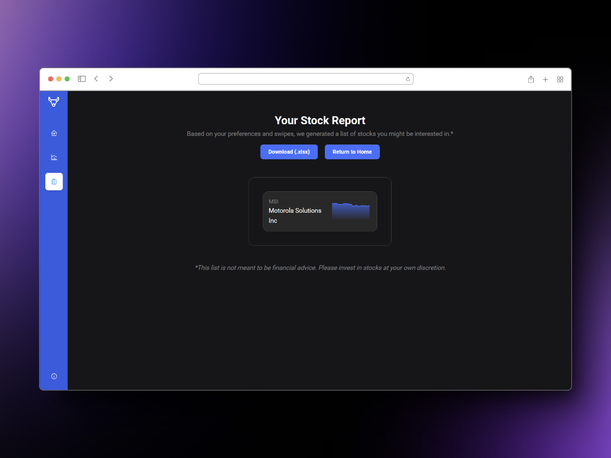

# MarketMatch

This is the frontend repository for MarketMatch, a 2024 Hacklytics team project entered on the finance track.


<div>


</div>

## About

Look at stocks in a new way with MarketMatch, a cross between a financial dashboard and the Tinder dating app. Aimed at beginners who are new to the stock market, we simplify the stock information we provide and help you search through hundreds of available stocks by using your investment preferences. We guide you through multiple stocks using a Tinder-like swiping interface, where you can save stocks for later by swiping right.


## Technologies Used

- Mantine
- Next.js
- React
- Zustand
- Typescript
- HTML
- CSS

## How to Use

### Clone project

```bash
git clone https://github.com/AlexT101/market-match
```

### Install dependencies

```bash
npm install
```

### Run the development server

```bash
npm run dev
```
